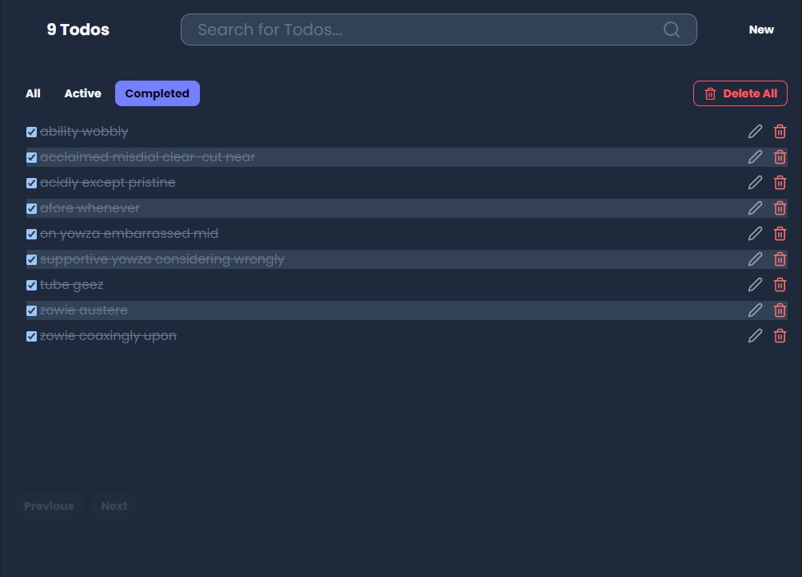

# Simple Todos project with [Next.js](https://nextjs.org/) in typescript
## In this project :
<ul>
    <li>Tailwind CSS & DaisyUI for styling</li>
    <li>Prisma as ORM & sqlite for database</li>
    <li><b>C</b>reate <b>R</b>ead <b>U</b>pdate <b>D</b>elete Todos</li>
    <li>Dynamic search bar</li>
    <li>Filtering by status [All, Active, Completed]</li>
</ul>

    
